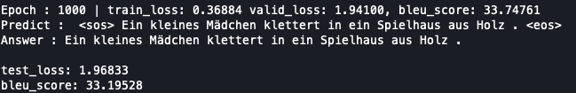

# Transformer Implement(Unofficial)

Transformer 모델을 이용해 machine translation task를 학습합니다.

[논문](https://arxiv.org/pdf/1706.03762.pdf)에서 공식적인 내용을 확인할 수 있으며, [블로그](https://www.notion.so/pervin0527/Transformer-7cc4a9eb95714166acb1ce9ac1fd8c4e)에는 제가 논문을 읽고 정리한 내용을 볼 수 있습니다.

## Abstract

Transformer는 Encoder-Decoder 구조를 갖고 있으며, Attention 알고리즘을 기본으로 하는 모델입니다.

- Word Embedding에 Positional Encoding을 더해 문장을 구성하는 단어들의 위치 정보를 파악합니다. 이를 통해 동일하지만 서로 다른 순서(위치) 정보를 반영할 수 있게 됩니다.
- Multi-Head라는 병렬적 Attention을 통해, 연산의 효율성과 속도가 향상되었으며, 여러 시각에서 단어들의 연관성 및 문장의 구조를 파악합니다.
- Encoder에는 Multi-Head Self Attention layer를 통해 입력된 문장을 구성하는 단어들간 연관성을 계산합니다.
- Decoder는 Multi-Head Self Attention과 Multi-Head Cross Attention(Cross Attention)으로 생성할 번역 문장을 더 잘 예측합니다.

## Dataset

Multi30K 데이터셋을 사용합니다. "train.py"에서 데이터가 자동적으로 다운로드 되며 train, valid, test로 분할하고 vocab을 생성하며 이를 pickle파일로 저장합니다.  
현재는 독일어(de)와 영어(en)을 사용해 번역을 학습하도록 설정되어 있습니다.

    download_multi30k(DATA_DIR)
    make_cache(f"{DATA_DIR}/Multi30k")

    DATASET = Multi30k(data_dir=f"{DATA_DIR}/Multi30k",
                       source_language=SRC_LANGUAGE,
                       target_language=TRG_LANGUAGE,
                       max_seq_len=MAX_SEQ_LEN,
                       vocab_min_freq=2)

## Model

build_model.py에서 모델을 구성하는 모든 객체(layer)들을 정의하고, Transformer 모델을 구축합니다.  
Hyper-Parameter는 "Config.py"에서 설정할 수 있습니다.

    model = build_model(len(DATASET.src_vocab), len(DATASET.trg_vocab), device=DEVICE, drop_prob=DROP_PROB)

## Experiment

